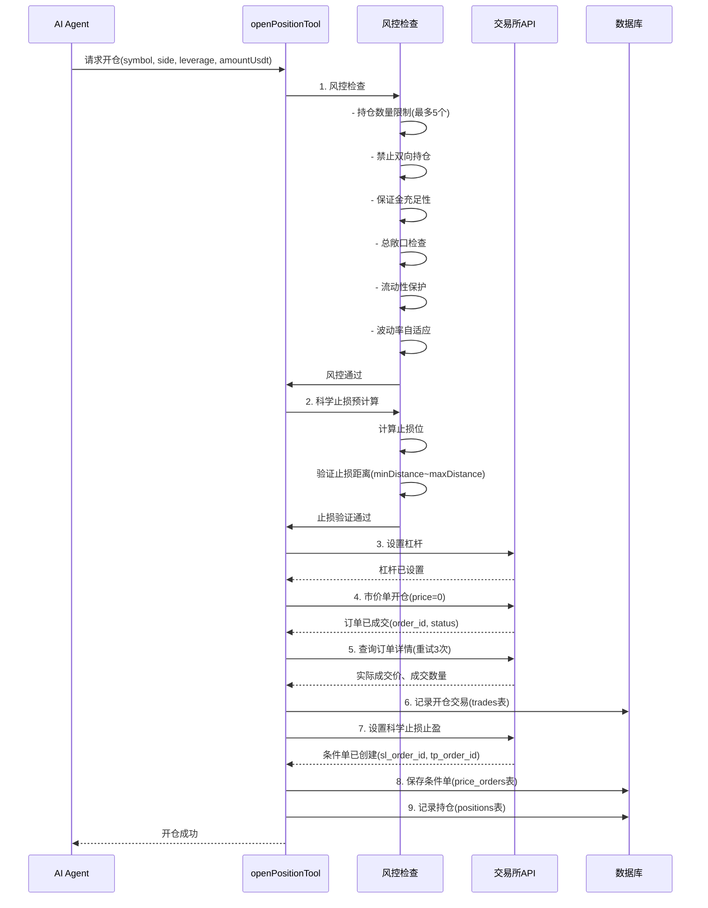
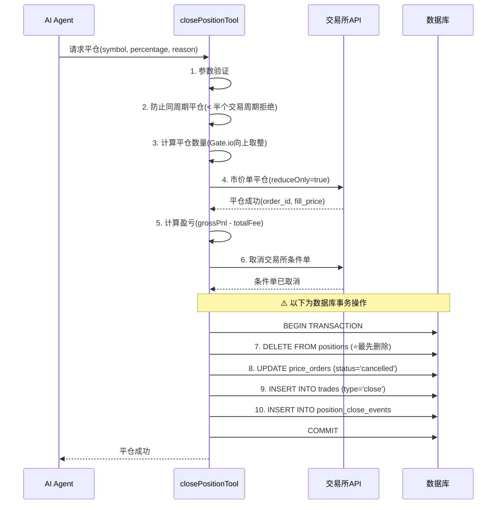
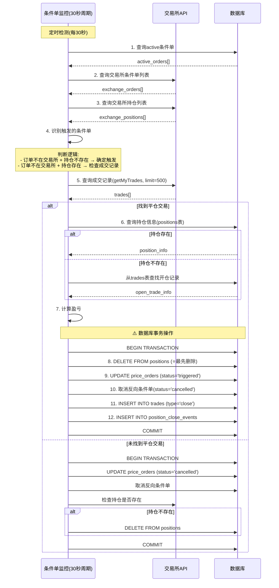

# 事务保护实现方案（完整版）

> **文档版本**: v2.1  
> **创建时间**: 2025-01-12  
> **最后更新**: 2025-01-12  
> **维护者**: game14.cn  
> **状态**: 所有核心功能（含邮件告警）已实施完成 ✅
> **关联文档**:
>
> - [系统交易流程与状态管理分析.md](./系统交易流程与状态管理分析.md)
> - [自动止损单系统 - 实现说明.md](./自动止损单系统%20-%20实现说明.md)

---

## 📋 目录

1. [问题概述](#问题概述)
2. [架构深度分析](#架构深度分析)
3. [核心业务流程](#核心业务流程)
4. [事务保护方案](#事务保护方案)
5. [多交易所兼容性](#多交易所兼容性)
6. [异常状态管理](#异常状态管理)
7. [健康检查系统](#健康检查系统)
8. [实施步骤](#实施步骤)

---

## 问题概述

### 当前系统架构缺陷

当前系统在执行**平仓操作**和**条件单触发处理**时，数据库操作是**逐个独立执行**的，缺乏事务保护。这导致如果某个步骤失败，会造成**数据不一致**，特别是：

#### 1. 持仓记录在最后才删除

```typescript
// ❌ 当前实现（有问题）
await dbClient.execute(`INSERT INTO trades ...`);                  // 步骤1
await dbClient.execute(`INSERT INTO position_close_events ...`);   // 步骤2
await exchangeClient.cancelPositionStopLoss(contract);             // 步骤3
await dbClient.execute(`UPDATE price_orders SET status='cancelled'...`); // 步骤4
await dbClient.execute(`DELETE FROM positions WHERE symbol=?...`); // 步骤5 ❌ 最后才删除!
```

**风险**：如果步骤3-5任何一步失败，`positions` 表仍保留持仓记录，导致：

- AI Agent 误认为持仓仍存在，继续发出管理指令
- 前端显示持仓但实际已平仓
- 条件单监控服务尝试管理不存在的持仓
- 可能触发重复平仓，导致"仓位不存在"错误

#### 2. 交易所操作与数据库操作混合

```typescript
// ❌ 即使使用事务也无法回滚交易所操作
await dbClient.execute('BEGIN TRANSACTION');
try {
  await dbClient.execute(`INSERT INTO trades ...`);
  await exchangeClient.cancelPositionStopLoss(contract); // ⚠️ 交易所操作无法回滚!
  await dbClient.execute(`UPDATE price_orders ...`);
  await dbClient.execute('COMMIT');
} catch (error) {
  await dbClient.execute('ROLLBACK'); // 但交易所的取消操作已经执行了!
}
```

**问题**：交易所API调用不支持回滚，一旦执行就生效，数据库回滚无法撤销交易所状态变更。

#### 3. 缺乏异常状态记录

当交易所操作成功但数据库操作失败时，系统无法追踪这种**不一致状态**，导致：

- 无法自动恢复
- 难以定位问题
- 需要人工介入时缺乏依据

#### 4. 多交易所适配差异

- **Gate.io**：反向合约（inverse），数量单位是"张"，需要合约乘数（quanto multiplier）
- **Binance**：正向合约（linear），数量单位是"币"，直接计算

不同交易所在精度、数量计算、API响应格式上的差异，增加了事务保护的复杂性。

---

## 架构深度分析

### 系统核心组件关系图

```bash
┌─────────────────────────────────────────────────────────────────┐
│                        Trading Loop 交易循环                      │
│                    (src/scheduler/tradingLoop.ts)               │
│  - 定时触发 AI 决策 (每60秒)                                     │
│  - 收集市场数据 (K线、指标、订单簿)                               │
│  - 周期性同步持仓状态 (每5分钟)                                   │
│  - 强制风控检查 (持仓数量、总敞口、回撤)                          │
└──────────────┬──────────────────────────────┬──────────────────┘
               │                              │
               │ AI决策触发                     │ 定时同步
               │                              │
       ┌───────▼────────┐           ┌────────▼──────────────┐
       │  Trading Agent │           │  Condition Monitor     │
       │   AI代理工具   │           │   条件单监控服务       │
       │ (tradingAgent) │           │ (priceOrderMonitor)    │
       │                │           │                        │
       │ - openPosition │           │ - 每30秒检测触发       │
       │ - closePosition│           │ - 更新条件单状态       │
       │ - setStopLoss  │           │ - 记录平仓事件         │
       │ - partialClose │           │ - 清理孤儿订单         │
       └───────┬────────┘           └────────┬──────────────┘
               │                              │
               │ 调用交易所API                  │ 查询成交记录
               │                              │
       ┌───────▼──────────────────────────────▼──────────────┐
       │        Exchange Client 交易所接口抽象层              │
       │          (src/exchanges/IExchangeClient)            │
       │                                                      │
       │  ┌─────────────────┐      ┌──────────────────┐    │
       │  │ Gate.io Client  │      │ Binance Client   │    │
       │  │ (反向合约)      │      │ (正向合约)       │    │
       │  │ - 张数计算      │      │ - 币数量计算      │    │
       │  │ - quanto乘数    │      │ - 精度处理       │    │
       │  └─────────────────┘      └──────────────────┘    │
       │                                                      │
       │  - placeOrder (下单)                                │
       │  - setPositionStopLoss (设置条件单)                 │
       │  - cancelPositionStopLoss (取消条件单)              │
       │  - getPositions (查询持仓)                          │
       │  - getPriceOrders (查询条件单)                      │
       │  - getMyTrades (查询成交记录)                       │
       └──────────────────┬──────────────────────────────────┘
                          │
                          │ 双向同步
                          │
       ┌──────────────────▼──────────────────────────────────┐
       │            Database Layer 数据库层 (LibSQL)          │
       │          (src/database/*.ts)                        │
       │                                                      │
       │  核心表结构:                                          │
       │  - trades                  (交易记录)               │
       │  - positions               (持仓记录)               │
       │  - price_orders            (条件单)                 │
       │  - position_close_events   (平仓事件)               │
       │  - inconsistent_states     (不一致状态追踪) 🆕       │
       │                                                      │
       │  数据流:                                              │
       │  1. 开仓: AI → 交易所 → 数据库                       │
       │  2. 条件单触发: 交易所(自动) → 监控服务 → 数据库      │
       │  3. AI主动平仓: AI → 交易所 → 数据库                │
       │  4. 状态同步: 交易所 ← 数据库 (周期性校验)           │
       └──────────────────────────────────────────────────────┘
```

### 数据一致性关键点

| 数据项 | 交易所API | 数据库 | 权威来源 | 一致性策略 |
|-------|----------|--------|---------|-----------|
| 持仓状态 | 实时准确 | 可能延迟 | 交易所 | 周期性同步 + 事务保护 |
| 条件单状态 | 实时准确 | 可能延迟 | 交易所 | 事件驱动更新 + 健康检查 |
| 成交记录 | 权威来源 | 镜像存储 | 交易所 | 单向同步，不可修改 |
| 盈亏计算 | 实时浮盈 | 历史记录 | 平仓时固化 | 实际成交价格计算 |

---

## 核心业务流程

### 1. 开仓流程 (openPositionTool)



**关键点**：

1. **开仓前强制验证止损**：拒绝止损距离过近(<0.5%)或过远(>5%)的交易
2. **滑点保护**：成交价偏离超过2%自动回滚交易
3. **实际成交价获取**：等待2秒后查询，最多重试3次
4. **科学止损止盈**：开仓后立即在交易所设置条件单，不依赖本地监控

### 2. AI主动平仓流程 (closePositionTool)



**当前问题**：

- ❌ 步骤7-10没有事务保护
- ❌ 持仓记录（步骤7）在最后才删除
- ❌ 如果步骤6-10任何一步失败，数据不一致

**改进方案**：

1. 交易所操作（步骤4-6）与数据库操作（步骤7-10）分离
2. 数据库操作使用事务包裹
3. 持仓记录在事务中最先删除
4. 交易所操作失败直接返回，数据库操作失败记录异常状态

### 3. 条件单触发平仓流程 (priceOrderMonitor)



**当前问题**：

- ❌ 步骤8-12没有事务保护
- ❌ 如果步骤11失败，数据库有持仓但无平仓记录
- ❌ 如果成交记录查询失败，可能遗漏平仓事件

**已实施的修复**：

- ✅ 扩展成交记录查询到500笔、24小时窗口
- ✅ 移除虚假平仓记录创建逻辑
- ✅ 增加并发保护（isRunning标志）

**待改进**：

- ⏳ 步骤8-12使用事务包裹
- ⏳ 持仓记录在事务中最先删除
- ⏳ 失败时记录异常状态

---

## 事务保护方案

### 方案设计原则

1. **交易所操作与数据库操作分离**：交易所API调用不可回滚，必须先完成
2. **补偿事务模式 (Saga Pattern)**：交易所操作失败直接返回，成功后再执行数据库事务
3. **操作顺序优化**：关键操作（删除持仓）放在事务最前面
4. **异常状态记录**：交易所成功但数据库失败时，记录到专门的表供人工处理
5. **幂等性保证**：支持重复执行不产生副作用

### 方案1: 标准事务 + 操作顺序优化 (推荐)

#### 1.1 修改 closePositionTool 完整实现

```typescript
// 文件: src/tools/trading/tradeExecution.ts

export const closePositionTool = createTool({
  name: "closePosition",
  description: `平仓 - 平掉指定币种的持仓（支持部分平仓）`,
  parameters: z.object({
    symbol: z.enum(RISK_PARAMS.TRADING_SYMBOLS).describe("币种代码"),
    percentage: z.number().min(1).max(100).describe("平仓比例 (1-100)"),
    reason: z.string().optional().describe("平仓原因"),
  }),
  execute: async ({ symbol, percentage, reason = 'manual_close' }) => {
    const exchangeClient = getExchangeClient();
    const contract = exchangeClient.normalizeContract(symbol);
    const timestamp = getChinaTimeISO();
    
    try {
      // ========== 阶段0: 参数验证和持仓检查 ==========
      logger.info(`🔄 阶段0: 参数验证...`);
      
      // 查询持仓
      const positions = await exchangeClient.getPositions();
      const position = positions.find((p: any) => {
        const posSymbol = exchangeClient.extractSymbol(p.contract);
        return posSymbol === symbol && Math.abs(parsePositionSize(p.size)) > 0;
      });
      
      if (!position) {
        return {
          success: false,
          message: `${symbol} 没有持仓，无法平仓`,
        };
      }
      
      const positionSize = parsePositionSize(position.size);
      const side = positionSize > 0 ? "long" : "short";
      const entryPrice = Number.parseFloat(position.entryPrice || "0");
      const leverage = Number.parseInt(position.leverage || "1");
      
      // 防止同周期平仓保护
      const dbPositionResult = await dbClient.execute({
        sql: 'SELECT opened_at FROM positions WHERE symbol = ? AND side = ?',
        args: [symbol, side]
      });
      
      if (dbPositionResult.rows.length > 0) {
        const openedAt = dbPositionResult.rows[0].opened_at as string;
        const openTime = new Date(openedAt).getTime();
        const nowTime = Date.now();
        const holdingTimeMinutes = (nowTime - openTime) / (1000 * 60);
        const minHoldingMinutes = (RISK_PARAMS.LOOP_INTERVAL_SECONDS / 60) * 0.5;
        
        if (holdingTimeMinutes < minHoldingMinutes) {
          return {
            success: false,
            message: `${symbol} 持仓时间过短 (${holdingTimeMinutes.toFixed(1)}分钟 < ${minHoldingMinutes}分钟)，防止同周期平仓`,
          };
        }
      }
      
      // 计算平仓数量
      let closeSize: number;
      if (percentage === 100) {
        closeSize = Math.abs(positionSize);
      } else {
        closeSize = Math.abs(positionSize) * (percentage / 100);
      }
      
      // Gate.io 反向合约：向上取整到最小张数
      const contractType = exchangeClient.getContractType();
      if (contractType === 'inverse') {
        closeSize = Math.ceil(closeSize);
      } else {
        // Binance 正向合约：精度处理
        closeSize = adjustQuantityPrecision(closeSize, symbol);
      }
      
      // 验证最小交易数量
      const contractInfo = await exchangeClient.getContractInfo(contract);
      const minSize = contractInfo.orderSizeMin || 1;
      
      if (closeSize < minSize) {
        return {
          success: false,
          message: `平仓数量 ${closeSize} 小于最小限制 ${minSize}`,
        };
      }
      
      const size = side === "long" ? -closeSize : closeSize;
      const unit = contractType === 'inverse' ? '张' : symbol;
      
      logger.info(`✅ 参数验证通过: ${symbol} ${side} ${closeSize}${unit} (${percentage}%)`);
      
      // ========== 阶段1: 交易所操作 (不可回滚部分) ==========
      logger.info('🔄 阶段1: 执行交易所操作...');
      
      let order: any;
      let actualExitPrice: number;
      let actualCloseSize: number;
      let finalOrderStatus: string;
      let orderFillTime: string;
      
      try {
        // 1.1 市价单平仓
        logger.debug(`发送平仓订单: size=${size}, reduceOnly=true`);
        order = await exchangeClient.placeOrder({
          contract,
          size,
          price: 0,
          reduceOnly: true,
        });
        
        logger.info(`📨 平仓订单已提交: order_id=${order.id}`);
        
        // 1.2 等待并获取实际成交信息（重试机制）
        await new Promise(resolve => setTimeout(resolve, 500));
        
        let retryCount = 0;
        const maxRetries = 3;
        let orderDetailSuccess = false;
        
        while (retryCount < maxRetries && !orderDetailSuccess) {
          try {
            const orderDetail = await exchangeClient.getOrder(order.id.toString());
            
            // 解析成交数量
            const totalSize = Math.abs(Number.parseFloat(orderDetail.size || "0"));
            const leftSize = Math.abs(Number.parseFloat(orderDetail.left || "0"));
            actualCloseSize = totalSize - leftSize;
            
            // 解析成交价格
            if (orderDetail.fill_price && Number.parseFloat(orderDetail.fill_price) > 0) {
              actualExitPrice = Number.parseFloat(orderDetail.fill_price);
            } else if (orderDetail.price && Number.parseFloat(orderDetail.price) > 0) {
              actualExitPrice = Number.parseFloat(orderDetail.price);
            } else {
              // 如果订单详情没有价格，查询成交记录
              logger.warn(`订单详情无成交价，查询成交记录...`);
              const trades = await exchangeClient.getMyTrades(contract, 10);
              const matchingTrade = trades.find((t: any) => 
                (t.order_id?.toString() === order.id?.toString()) ||
                (t.orderId?.toString() === order.id?.toString())
              );
              if (matchingTrade) {
                actualExitPrice = Number.parseFloat(matchingTrade.price || matchingTrade.avgPrice || "0");
              } else {
                throw new Error('无法获取实际成交价格');
              }
            }
            
            finalOrderStatus = orderDetail.status;
            
            // 成交时间（优先使用订单详情，否则使用当前时间）
            if (orderDetail.finish_time) {
              orderFillTime = new Date(orderDetail.finish_time * 1000).toISOString();
            } else if (orderDetail.create_time) {
              orderFillTime = new Date(orderDetail.create_time * 1000).toISOString();
            } else {
              orderFillTime = timestamp;
            }
            
            logger.info(`✅ 平仓成交: ${actualCloseSize}${unit} @ ${actualExitPrice.toFixed(2)} USDT`);
            orderDetailSuccess = true;
            
          } catch (error: any) {
            retryCount++;
            if (retryCount >= maxRetries) {
              logger.error(`获取订单详情失败（重试${retryCount}次）: ${error.message}`);
              // 使用预估值继续
              actualCloseSize = closeSize;
              const ticker = await exchangeClient.getFuturesTicker(contract);
              actualExitPrice = Number.parseFloat(ticker.last || "0");
              finalOrderStatus = 'unknown';
              orderFillTime = timestamp;
              logger.warn(`⚠️ 使用预估值: 数量=${actualCloseSize}, 价格=${actualExitPrice}`);
            } else {
              logger.warn(`获取订单详情失败，${retryCount}/${maxRetries} 次重试...`);
              await new Promise(resolve => setTimeout(resolve, 300));
            }
          }
        }
        
      } catch (exchangeError: any) {
        logger.error('❌ 交易所平仓失败:', exchangeError);
        return {
          success: false,
          message: `平仓失败: ${exchangeError.message}`,
          error: exchangeError.message,
        };
      }
      
      // 1.3 计算盈亏
      logger.debug(`计算盈亏: entry=${entryPrice}, exit=${actualExitPrice}, size=${actualCloseSize}`);
      
      const grossPnl = await exchangeClient.calculatePnl(
        entryPrice, actualExitPrice, actualCloseSize, side, contract
      );
      
      // 计算手续费（开仓 + 平仓）
      let positionValue: number;
      if (contractType === 'inverse') {
        const quantoMultiplier = await getQuantoMultiplier(contract);
        positionValue = actualCloseSize * quantoMultiplier * actualExitPrice;
      } else {
        positionValue = actualCloseSize * actualExitPrice;
      }
      
      const openFee = positionValue * 0.0005; // 0.05% taker费率
      const closeFee = positionValue * 0.0005;
      const totalFee = openFee + closeFee;
      const netPnl = grossPnl - totalFee;
      
      // 计算盈亏百分比（含杠杆）
      const priceChangePercent = side === "long"
        ? ((actualExitPrice - entryPrice) / entryPrice) * 100
        : ((entryPrice - actualExitPrice) / entryPrice) * 100;
      const pnlPercent = priceChangePercent * leverage;
      
      logger.info(`💰 盈亏: 毛利=${grossPnl.toFixed(2)} USDT, 手续费=${totalFee.toFixed(2)} USDT, 净利=${netPnl.toFixed(2)} USDT (${pnlPercent.toFixed(2)}%)`);
      
      // 1.4 取消交易所条件单（只在100%平仓时）
      let cancelSuccess = false;
      if (percentage === 100) {
        try {
          logger.debug(`取消交易所条件单: ${contract}`);
          const cancelResult = await exchangeClient.cancelPositionStopLoss(contract);
          cancelSuccess = cancelResult.success;
          logger.info(cancelSuccess ? '✅ 条件单已取消' : '⚠️ 条件单取消失败');
        } catch (cancelError: any) {
          logger.warn('⚠️ 取消条件单异常:', cancelError.message);
        }
      }
      
      // ========== 阶段2: 数据库事务操作 ==========
      logger.info('🔄 阶段2: 执行数据库事务...');
      
      // 开启事务
      await dbClient.execute('BEGIN TRANSACTION');
      
      try {
        // ⭐️ 2.1 最关键: 先删除持仓记录（100%平仓时）
        // 即使后续步骤失败，也不会误认为持仓存在
        if (percentage === 100) {
          await dbClient.execute({
            sql: 'DELETE FROM positions WHERE symbol = ? AND side = ?',
            args: [symbol, side]
          });
          logger.debug('✅ [事务] 步骤1: 持仓记录已删除');
        } else {
          // 部分平仓：更新持仓数量
          const newQuantity = Math.abs(positionSize) - actualCloseSize;
          await dbClient.execute({
            sql: 'UPDATE positions SET quantity = ? WHERE symbol = ? AND side = ?',
            args: [newQuantity, symbol, side]
          });
          logger.debug(`✅ [事务] 步骤1: 持仓数量已更新 ${Math.abs(positionSize)} → ${newQuantity}`);
        }
        
        // ⭐️ 2.2 第二关键: 更新条件单状态（100%平仓时）
        // 防止条件单监控服务误判为触发
        if (percentage === 100) {
          await dbClient.execute({
            sql: `UPDATE price_orders 
                  SET status = 'cancelled', updated_at = ?
                  WHERE symbol = ? AND side = ? AND status = 'active'`,
            args: [timestamp, symbol, side]
          });
          logger.debug('✅ [事务] 步骤2: 条件单状态已更新');
        }
        
        // 2.3 插入平仓交易记录
        await dbClient.execute({
          sql: `INSERT INTO trades 
                (order_id, symbol, side, type, price, quantity, leverage, 
                 pnl, fee, timestamp, status)
                VALUES (?, ?, ?, ?, ?, ?, ?, ?, ?, ?, ?)`,
          args: [
            order.id?.toString() || '',
            symbol, side, 'close',
            actualExitPrice, actualCloseSize, leverage,
            netPnl, totalFee, orderFillTime,
            finalOrderStatus === 'finished' ? 'filled' : 'pending'
          ]
        });
        logger.debug('✅ [事务] 步骤3: 交易记录已插入');
        
        // 2.4 插入平仓事件 (供AI决策参考)
        await dbClient.execute({
          sql: `INSERT INTO position_close_events 
                (symbol, side, entry_price, close_price, quantity, leverage,
                 pnl, pnl_percent, fee, close_reason, trigger_type, order_id,
                 created_at, processed)
                VALUES (?, ?, ?, ?, ?, ?, ?, ?, ?, ?, ?, ?, ?, ?)`,
          args: [
            symbol, side, entryPrice, actualExitPrice, actualCloseSize, leverage,
            netPnl, pnlPercent, totalFee, reason, 'ai_decision',
            order.id?.toString() || '', timestamp, 1
          ]
        });
        logger.debug('✅ [事务] 步骤4: 平仓事件已记录');
        
        // 提交事务
        await dbClient.execute('COMMIT');
        logger.info('✅ [事务] 所有数据库操作已提交');
        
        // 返回成功
        return {
          success: true,
          orderId: order.id?.toString(),
          symbol,
          side,
          percentage,
          closedSize: actualCloseSize,
          entryPrice,
          exitPrice: actualExitPrice,
          pnl: netPnl,
          pnlPercent,
          fee: totalFee,
          message: `成功平仓 ${symbol} ${actualCloseSize}${unit} (${percentage}%)，净盈亏 ${netPnl >= 0 ? '+' : ''}${netPnl.toFixed(2)} USDT (${pnlPercent >= 0 ? '+' : ''}${pnlPercent.toFixed(2)}%)`,
        };
        
      } catch (dbError: any) {
        // 回滚事务
        await dbClient.execute('ROLLBACK');
        logger.error('❌ [事务] 数据库操作失败，已回滚:', dbError);
        
        // ⚠️ 关键: 记录不一致状态
        // 交易所操作已完成，但数据库记录失败
        await recordInconsistentState({
          operation: 'close_position',
          symbol,
          side,
          exchangeSuccess: true,
          dbSuccess: false,
          exchangeOrderId: order.id?.toString(),
          errorMessage: dbError.message,
          timestamp,
        });
        
        return {
          success: false,
          partialSuccess: true,  // 交易所操作成功
          needsManualCheck: true,
          message: '平仓成功但数据记录失败，需要人工检查数据一致性',
          orderId: order.id?.toString(),
          error: dbError.message,
        };
      }
      
    } catch (error: any) {
      logger.error('平仓失败:', error);
      return {
        success: false,
        error: error.message,
        message: `平仓失败: ${error.message}`,
      };
    }
  },
});

// 辅助函数: 记录不一致状态
async function recordInconsistentState(data: {
  operation: string;
  symbol: string;
  side: string;
  exchangeSuccess: boolean;
  dbSuccess: boolean;
  exchangeOrderId?: string;
  errorMessage: string;
  timestamp: string;
}) {
  try {
    await dbClient.execute({
      sql: `INSERT INTO inconsistent_states 
            (operation, symbol, side, exchange_success, db_success, 
             exchange_order_id, error_message, created_at, resolved)
            VALUES (?, ?, ?, ?, ?, ?, ?, ?, ?)`,
      args: [
        data.operation,
        data.symbol,
        data.side,
        data.exchangeSuccess ? 1 : 0,
        data.dbSuccess ? 1 : 0,
        data.exchangeOrderId || null,
        data.errorMessage,
        data.timestamp,
        0  // 未解决
      ]
    });
    logger.warn('⚠️ 已记录不一致状态到数据库');
  } catch (recordError: any) {
    logger.error('❌ 记录不一致状态失败:', recordError);
    // 记录到文件作为备份
    const fs = require('fs');
    const logPath = './logs/inconsistent_states.log';
    fs.appendFileSync(logPath, JSON.stringify(data) + '\n');
  }
}
```

#### 1.2 修改 priceOrderMonitor 完整实现

```typescript
// 文件: src/scheduler/priceOrderMonitor.ts

/**
 * 处理已触发的条件单
 */
private async handleTriggeredOrder(order: DBPriceOrder) {
  logger.debug(`🔍 检查条件单: ${order.symbol} ${order.type} ${order.order_id}`);

  // 阶段1: 查询持仓信息 (用于计算PnL)
  let position = await this.getPositionInfo(order.symbol, order.side);
  
  // 如果数据库中没有持仓记录，尝试从开仓交易记录中查找
  if (!position) {
    logger.warn(`数据库中未找到 ${order.symbol} ${order.side} 的持仓信息，尝试从交易记录查找...`);
    const openTrade = await this.findOpenTrade(order.symbol, order.side);
    if (openTrade) {
      // 使用开仓交易信息构建持仓对象
      position = {
        symbol: openTrade.symbol,
        side: openTrade.side,
        entry_price: openTrade.price,
        quantity: openTrade.quantity,
        leverage: openTrade.leverage,
      };
      logger.info(`✅ 从交易记录恢复持仓信息: ${order.symbol} @ ${position.entry_price}`);
    }
  }
  
  // 阶段2: 查找平仓交易（从交易所查询实际的成交记录）
  const closeTrade = await this.findCloseTrade(order);
  
  // ⚠️ 关键修复：如果交易所没有平仓记录，说明条件单并未真正触发
  //    可能的原因：
  //    a) 条件单被手动取消
  //    b) 持仓已通过其他方式平仓（手动平仓、其他条件单触发）
  //    c) 系统异常导致状态不一致
  //    
  //    正确的处理方式：标记为cancelled，不创建虚假的平仓记录
  if (!closeTrade) {
    logger.warn(`⚠️ 未找到 ${order.symbol} 的平仓交易记录，条件单可能被取消或持仓已通过其他方式平仓`);
    
    // 开启事务处理状态更新
    await this.dbClient.execute('BEGIN TRANSACTION');
    
    try {
      // 只更新条件单状态为cancelled
      await this.updateOrderStatus(order.order_id, 'cancelled');
      logger.debug('✅ [事务] 步骤1: 条件单状态已更新为cancelled');
      
      // 取消反向条件单
      await this.cancelOppositeOrderInDB(order);
      logger.debug('✅ [事务] 步骤2: 反向条件单已取消');
      
      // 检查持仓是否还存在
      const contract = this.exchangeClient.normalizeContract(order.symbol);
      const positions = await this.exchangeClient.getPositions();
      const positionExists = positions.some(p => 
        p.contract === contract && Math.abs(parseFloat(p.size || '0')) > 0
      );
      
      if (!positionExists) {
        // 持仓确实不存在了，从数据库中删除
        await this.dbClient.execute({
          sql: 'DELETE FROM positions WHERE symbol = ? AND side = ?',
          args: [order.symbol, order.side]
        });
        logger.debug('✅ [事务] 步骤3: 持仓记录已删除');
      } else {
        logger.info(`${order.symbol} 持仓仍存在，保留数据库记录`);
      }
      
      // 提交事务
      await this.dbClient.execute('COMMIT');
      logger.info(`✅ [事务] ${order.symbol} 条件单状态更新完成`);
      
    } catch (error: any) {
      // 回滚事务
      await this.dbClient.execute('ROLLBACK');
      logger.error('❌ [事务] 更新条件单状态失败，已回滚:', error);
    }
    
    return;
  }
  
  // 阶段3: 确认有持仓信息才继续
  if (!position) {
    logger.error(`❌ 无法获取 ${order.symbol} ${order.side} 的持仓信息，无法记录平仓事件`);
    // 即使无法记录详情，也要更新条件单状态
    await this.updateOrderStatus(order.order_id, 'triggered');
    await this.cancelOppositeOrderInDB(order);
    return;
  }
  
  // 阶段4: 确认是真实平仓，计算盈亏
  logger.info(`🔔 确认条件单触发: ${order.symbol} ${order.type}, 平仓价格: ${closeTrade.price}`);
  
  const entryPrice = parseFloat(position.entry_price as string);
  const exitPrice = parseFloat(closeTrade.price);
  const quantity = Math.abs(parseFloat(closeTrade.size));
  const leverage = position.leverage || 1;
  
  logger.debug(`计算盈亏: entry=${entryPrice}, exit=${exitPrice}, quantity=${quantity}, leverage=${leverage}`);
  
  // 使用交易所的calculatePnl方法
  const grossPnl = await this.exchangeClient.calculatePnl(
    entryPrice, exitPrice, quantity, order.side, 
    this.exchangeClient.normalizeContract(order.symbol)
  );
  
  // 计算手续费
  const contractType = this.exchangeClient.getContractType();
  let positionValue: number;
  
  if (contractType === 'inverse') {
    const contract = this.exchangeClient.normalizeContract(order.symbol);
    const quantoMultiplier = await getQuantoMultiplier(contract);
    positionValue = quantity * quantoMultiplier * exitPrice;
  } else {
    positionValue = quantity * exitPrice;
  }
  
  const openFee = positionValue * 0.0005;
  const closeFee = positionValue * 0.0005;
  const totalFee = openFee + closeFee;
  const netPnl = grossPnl - totalFee;
  
  // 计算盈亏百分比
  const priceChangePercent = order.side === "long"
    ? ((exitPrice - entryPrice) / entryPrice) * 100
    : ((entryPrice - exitPrice) / entryPrice) * 100;
  const pnlPercent = priceChangePercent * leverage;
  
  logger.info(`💰 盈亏: 毛利=${grossPnl.toFixed(2)} USDT, 手续费=${totalFee.toFixed(2)} USDT, 净利=${netPnl.toFixed(2)} USDT (${pnlPercent.toFixed(2)}%)`);
  
  // 阶段5: 数据库事务操作
  const timestamp = new Date().toISOString();
  
  await this.dbClient.execute('BEGIN TRANSACTION');
  
  try {
    // ⭐️ 5.1 先删除持仓记录
    // 即使后续步骤失败，也不会误认为持仓存在
    await this.dbClient.execute({
      sql: 'DELETE FROM positions WHERE symbol = ? AND side = ?',
      args: [order.symbol, order.side]
    });
    logger.debug('✅ [事务] 步骤1: 持仓记录已删除');
    
    // ⭐️ 5.2 更新触发的条件单状态
    await this.updateOrderStatus(order.order_id, 'triggered');
    logger.debug('✅ [事务] 步骤2: 条件单状态已更新为triggered');
    
    // 5.3 取消反向条件单
    await this.cancelOppositeOrderInDB(order);
    logger.debug('✅ [事务] 步骤3: 反向条件单已取消');
    
    // 5.4 记录平仓交易
    await this.dbClient.execute({
      sql: `INSERT INTO trades 
            (order_id, symbol, side, type, price, quantity, leverage, pnl, fee, timestamp, status)
            VALUES (?, ?, ?, ?, ?, ?, ?, ?, ?, ?, ?)`,
      args: [
        closeTrade.id,
        order.symbol,
        order.side,
        'close',
        exitPrice,
        quantity,
        leverage,
        netPnl,
        totalFee,
        timestamp,
        'filled'
      ]
    });
    logger.debug('✅ [事务] 步骤4: 交易记录已插入');
    
    // 5.5 记录平仓事件
    const closeReason = order.type === 'stop_loss' 
      ? 'stop_loss_triggered' 
      : 'take_profit_triggered';
    
    await this.dbClient.execute({
      sql: `INSERT INTO position_close_events 
            (symbol, side, close_reason, trigger_type, trigger_price, close_price, 
             entry_price, quantity, leverage, pnl, pnl_percent, fee, 
             trigger_order_id, close_trade_id, order_id, created_at, processed)
            VALUES (?, ?, ?, ?, ?, ?, ?, ?, ?, ?, ?, ?, ?, ?, ?, ?, ?)`,
      args: [
        order.symbol, order.side, closeReason, 'exchange_order',
        parseFloat(order.trigger_price), exitPrice, entryPrice,
        quantity, leverage, netPnl, pnlPercent, totalFee,
        order.order_id, closeTrade.id, order.order_id, timestamp, 0
      ]
    });
    logger.debug('✅ [事务] 步骤5: 平仓事件已记录');
    
    // 提交事务
    await this.dbClient.execute('COMMIT');
    logger.info(`✅ [事务] ${order.symbol} ${order.type} 触发处理完成`);
    
  } catch (error: any) {
    // 回滚事务
    await this.dbClient.execute('ROLLBACK');
    logger.error('❌ [事务] 条件单触发处理失败，已回滚:', error);
    
    // ⚠️ 记录不一致状态
    await recordInconsistentState({
      operation: 'price_order_triggered',
      symbol: order.symbol,
      side: order.side,
      exchangeSuccess: true,  // 交易所已平仓
      dbSuccess: false,       // 数据库记录失败
      exchangeOrderId: order.order_id,
      errorMessage: error.message,
      timestamp,
    });
  }
}

/**
 * 数据库内取消反向条件单 (不调用交易所API)
 */
private async cancelOppositeOrderInDB(triggeredOrder: DBPriceOrder) {
  const oppositeType = triggeredOrder.type === 'stop_loss' ? 'take_profit' : 'stop_loss';
  
  const result = await this.dbClient.execute({
    sql: `SELECT order_id FROM price_orders 
          WHERE symbol = ? AND side = ? AND type = ? AND status = 'active'
          LIMIT 1`,
    args: [triggeredOrder.symbol, triggeredOrder.side, oppositeType]
  });
  
  if (result.rows.length > 0) {
    const oppositeOrderId = result.rows[0].order_id as string;
    await this.updateOrderStatus(oppositeOrderId, 'cancelled');
    logger.debug(`✅ 已取消反向条件单: ${oppositeOrderId}`);
  }
}
```

---

## 多交易所兼容性

### Gate.io vs Binance 核心差异

| 维度 | Gate.io | Binance | 处理方案 |
|-----|---------|---------|---------|
| **合约类型** | 反向合约(inverse) | 正向合约(linear) | `exchangeClient.getContractType()` |
| **数量单位** | 张(contracts) | 币(coins) | 日志显示区分 |
| **数量精度** | 必须整数 | 支持小数 | Gate自动向上取整 |
| **合约乘数** | 需要quanto multiplier | 不需要 | `getQuantoMultiplier()` |
| **盈亏计算** | 反向：(1/entry - 1/exit) *size* multiplier | 正向：(exit - entry) * size | `calculatePnl()` |
| **成交价获取** | fill_price | avgPrice | 统一`formatTradeRecord()` |
| **条件单API** | /futures/usdt/price_orders | /fapi/v1/allOpenOrders | `getPriceOrders()` |
| **取消条件单** | DELETE /price_orders/{order_id} | DELETE /fapi/v1/allOpenOrders | `cancelPositionStopLoss()` |

### 数量计算兼容性处理

```typescript
// Gate.io 反向合约数量计算
if (contractType === 'inverse') {
  // 张数 = (保证金 * 杠杆) / (quantoMultiplier * 价格)
  const quantoMultiplier = await getQuantoMultiplier(contract);
  let quantity = (amountUsdt * leverage) / (quantoMultiplier * currentPrice);
  
  // ⭐️ 关键：向上取整到最小张数
  quantity = Math.ceil(quantity);
  
  logger.info(`Gate.io 反向合约: ${quantity}张 (multiplier=${quantoMultiplier})`);
  
} else {
  // Binance 正向合约数量计算
  // 数量(币) = (保证金 * 杠杆) / 价格
  let quantity = (amountUsdt * leverage) / currentPrice;
  
  // ⭐️ 精度处理：根据币种保留小数位
  quantity = adjustQuantityPrecision(quantity, symbol);
  
  logger.info(`Binance 正向合约: ${quantity} ${symbol}`);
}
```

### 成交价获取兼容性

```typescript
/**
 * 统一格式化成交数据，兼容Gate.io和Binance
 */
function formatTradeRecord(trade: any): {
  id: string;
  price: string;
  size: string;
  fee: string;
  timestamp: number;
} {
  return {
    id: trade.id?.toString() || trade.orderId?.toString() || trade.tradeId?.toString() || '',
    // Gate.io: price / deal_price, Binance: price / avgPrice
    price: trade.price?.toString() || trade.avgPrice?.toString() || trade.deal_price?.toString() || '0',
    // Gate.io: size / amount, Binance: qty / executedQty
    size: trade.size?.toString() || trade.qty?.toString() || trade.amount?.toString() || '0',
    // Gate.io: fee_amount, Binance: commission
    fee: trade.fee?.toString() || trade.commission?.toString() || trade.fee_amount?.toString() || '0',
    // Gate.io: create_time (秒级), Binance: time (毫秒级)
    timestamp: Number(trade.timestamp || trade.time || trade.create_time || Date.now()),
  };
}
```

### 条件单兼容性处理

```typescript
// Gate.io: 使用 price_orders API
async getPriceOrders() {
  const response = await this.client.futuresClient.listFuturesPriceTriggeredOrders('usdt');
  return response.map(o => ({
    id: o.id?.toString(),
    symbol: this.extractSymbol(o.initial.contract),
    type: o.trigger.price_type === 2 ? 'stop_loss' : 'take_profit',
    trigger_price: o.trigger.price,
    quantity: Math.abs(parseFloat(o.initial.size || '0')),
    status: o.status,
  }));
}

// Binance: 使用 allOpenOrders API
async getPriceOrders() {
  const response = await this.client.futuresOpenOrders();
  return response
    .filter((o: any) => o.type === 'STOP_MARKET' || o.type === 'TAKE_PROFIT_MARKET')
    .map(o => ({
      id: o.orderId?.toString(),
      symbol: this.extractSymbol(o.symbol),
      type: o.type === 'STOP_MARKET' ? 'stop_loss' : 'take_profit',
      trigger_price: o.stopPrice,
      quantity: Math.abs(parseFloat(o.origQty || '0')),
      status: o.status === 'NEW' ? 'active' : 'triggered',
    }));
}
```

---

## 异常状态管理

### 不一致状态检测表设计

```sql
-- 文件: src/database/schema.ts

-- 不一致状态记录表
CREATE TABLE IF NOT EXISTS inconsistent_states (
  id INTEGER PRIMARY KEY AUTOINCREMENT,
  operation TEXT NOT NULL,           -- 操作类型: 'close_position', 'open_position', 'price_order_triggered' 等
  symbol TEXT NOT NULL,               -- 币种
  side TEXT,                         -- 方向: 'long' / 'short'
  exchange_success BOOLEAN NOT NULL,  -- 交易所操作是否成功
  db_success BOOLEAN NOT NULL,        -- 数据库操作是否成功
  exchange_order_id TEXT,            -- 交易所订单ID
  error_message TEXT,                -- 错误信息
  resolved BOOLEAN DEFAULT 0,         -- 是否已解决
  resolved_at TEXT,                  -- 解决时间
  resolved_by TEXT,                  -- 解决方式 (auto/manual)
  resolution_notes TEXT,             -- 解决备注
  created_at TEXT NOT NULL           -- 创建时间
);

CREATE INDEX IF NOT EXISTS idx_inconsistent_states_resolved 
ON inconsistent_states(resolved, created_at);

CREATE INDEX IF NOT EXISTS idx_inconsistent_states_symbol 
ON inconsistent_states(symbol);

CREATE INDEX IF NOT EXISTS idx_inconsistent_states_operation 
ON inconsistent_states(operation);
```

### 异常状态分类与处理策略

| 场景 | 交易所状态 | 数据库状态 | 风险等级 | 处理策略 |
|-----|----------|----------|---------|---------|
| **场景A: 正常** | 成功 | 成功 | ✅ 无风险 | 无需处理 |
| **场景B: 交易所失败** | 失败 | 未执行 | ⚠️ 低风险 | 返回错误，AI重试 |
| **场景C: 数据库失败** | 成功 | 失败 | 🔴 高风险 | 记录异常状态，人工介入 |
| **场景D: 部分成功** | 成功 | 部分失败 | 🟠 中风险 | 记录异常，尝试自动修复 |

### 异常状态自动修复逻辑

```typescript
// 文件: src/scheduler/inconsistentStateResolver.ts

import { createClient } from "@libsql/client";
import { getExchangeClient } from "../exchanges";
import { createLogger } from "../utils/logger";

const logger = createLogger({
  name: "inconsistent-state-resolver",
  level: "info",
});

const dbClient = createClient({
  url: process.env.DATABASE_URL || "file:./.voltagent/trading.db",
});

/**
 * 不一致状态自动修复服务
 * 定期检查并尝试修复数据不一致问题
 */
export class InconsistentStateResolver {
  private resolveInterval: NodeJS.Timeout | null = null;

  /**
   * 启动自动修复服务
   */
  async start() {
    if (this.resolveInterval) {
      logger.warn('自动修复服务已在运行');
      return;
    }

    const intervalMinutes = parseInt(process.env.RESOLVE_INTERVAL_MINUTES || '10');
    logger.info(`启动不一致状态自动修复服务，检测间隔: ${intervalMinutes}分钟`);

    // 立即执行第一次
    await this.resolveInconsistentStates();

    // 定期执行
    this.resolveInterval = setInterval(async () => {
      await this.resolveInconsistentStates();
    }, intervalMinutes * 60 * 1000);
  }

  /**
   * 停止自动修复服务
   */
  stop() {
    if (this.resolveInterval) {
      clearInterval(this.resolveInterval);
      this.resolveInterval = null;
      logger.info('自动修复服务已停止');
    }
  }

  /**
   * 解决不一致状态
   */
  private async resolveInconsistentStates() {
    try {
      // 查询所有未解决的不一致状态
      const result = await dbClient.execute({
        sql: `SELECT * FROM inconsistent_states 
              WHERE resolved = 0 
              ORDER BY created_at ASC`
      });

      if (result.rows.length === 0) {
        logger.debug('没有待解决的不一致状态');
        return;
      }

      logger.info(`发现 ${result.rows.length} 个待解决的不一致状态，开始处理...`);

      for (const row of result.rows) {
        const state: any = row;
        
        try {
          const resolved = await this.resolveState(state);
          
          if (resolved) {
            // 标记为已解决
            await dbClient.execute({
              sql: `UPDATE inconsistent_states 
                    SET resolved = 1, resolved_at = ?, resolved_by = 'auto'
                    WHERE id = ?`,
              args: [new Date().toISOString(), state.id]
            });
            logger.info(`✅ 已自动修复不一致状态 #${state.id}: ${state.operation} ${state.symbol}`);
          }
        } catch (error: any) {
          logger.error(`❌ 修复不一致状态 #${state.id} 失败:`, error.message);
        }
      }
    } catch (error: any) {
      logger.error('处理不一致状态失败:', error);
    }
  }

  /**
   * 解决单个不一致状态
   */
  private async resolveState(state: any): Promise<boolean> {
    const exchangeClient = getExchangeClient();

    // 根据操作类型分别处理
    switch (state.operation) {
      case 'close_position':
        return await this.resolveClosePosition(state, exchangeClient);
      
      case 'open_position':
        return await this.resolveOpenPosition(state, exchangeClient);
      
      case 'price_order_triggered':
        return await this.resolvePriceOrderTriggered(state, exchangeClient);
      
      default:
        logger.warn(`未知的操作类型: ${state.operation}`);
        return false;
    }
  }

  /**
   * 修复平仓操作不一致
   * 
   * 情况: 交易所已平仓，但数据库记录失败
   * 策略: 补充数据库记录
   */
  private async resolveClosePosition(state: any, exchangeClient: any): Promise<boolean> {
    const { symbol, side, exchange_order_id } = state;

    logger.info(`🔧 修复平仓不一致: ${symbol} ${side}`);

    try {
      // 1. 验证交易所确实已平仓
      const positions = await exchangeClient.getPositions();
      const contract = exchangeClient.normalizeContract(symbol);
      const positionExists = positions.some((p: any) => 
        p.contract === contract && Math.abs(parseFloat(p.size || '0')) > 0
      );

      if (positionExists) {
        logger.warn(`${symbol} 持仓仍存在，无需修复`);
        return false;
      }

      // 2. 查询交易所的成交记录
      const trades = await exchangeClient.getMyTrades(contract, 100);
      const closeTrade = trades.find((t: any) => 
        (t.orderId?.toString() === exchange_order_id) ||
        (t.order_id?.toString() === exchange_order_id)
      );

      if (!closeTrade) {
        logger.warn(`未找到订单 ${exchange_order_id} 的成交记录`);
        return false;
      }

      // 3. 查询开仓信息（用于计算盈亏）
      const openTradeResult = await dbClient.execute({
        sql: `SELECT * FROM trades 
              WHERE symbol = ? AND side = ? AND type = 'open' 
              ORDER BY timestamp DESC LIMIT 1`,
        args: [symbol, side]
      });

      if (openTradeResult.rows.length === 0) {
        logger.warn(`未找到 ${symbol} ${side} 的开仓记录`);
        return false;
      }

      const openTrade: any = openTradeResult.rows[0];
      const entryPrice = parseFloat(openTrade.price);
      const exitPrice = parseFloat(closeTrade.price);
      const quantity = Math.abs(parseFloat(closeTrade.size));
      const leverage = openTrade.leverage || 1;

      // 4. 计算盈亏
      const grossPnl = await exchangeClient.calculatePnl(
        entryPrice, exitPrice, quantity, side, contract
      );

      const contractType = exchangeClient.getContractType();
      let positionValue: number;
      if (contractType === 'inverse') {
        const quantoMultiplier = await getQuantoMultiplier(contract);
        positionValue = quantity * quantoMultiplier * exitPrice;
      } else {
        positionValue = quantity * exitPrice;
      }

      const totalFee = positionValue * 0.001; // 0.1%
      const netPnl = grossPnl - totalFee;
      const priceChangePercent = side === "long"
        ? ((exitPrice - entryPrice) / entryPrice) * 100
        : ((entryPrice - exitPrice) / entryPrice) * 100;
      const pnlPercent = priceChangePercent * leverage;

      // 5. 开启事务补充数据库记录
      const timestamp = new Date().toISOString();
      await dbClient.execute('BEGIN TRANSACTION');

      try {
        // 删除持仓记录
        await dbClient.execute({
          sql: 'DELETE FROM positions WHERE symbol = ? AND side = ?',
          args: [symbol, side]
        });

        // 更新条件单状态
        await dbClient.execute({
          sql: `UPDATE price_orders 
                SET status = 'cancelled', updated_at = ?
                WHERE symbol = ? AND side = ? AND status = 'active'`,
          args: [timestamp, symbol, side]
        });

        // 插入交易记录
        await dbClient.execute({
          sql: `INSERT INTO trades 
                (order_id, symbol, side, type, price, quantity, leverage, pnl, fee, timestamp, status)
                VALUES (?, ?, ?, ?, ?, ?, ?, ?, ?, ?, ?)`,
          args: [
            exchange_order_id, symbol, side, 'close',
            exitPrice, quantity, leverage, netPnl, totalFee, timestamp, 'filled'
          ]
        });

        // 插入平仓事件
        await dbClient.execute({
          sql: `INSERT INTO position_close_events 
                (symbol, side, entry_price, close_price, quantity, leverage,
                 pnl, pnl_percent, fee, close_reason, trigger_type, order_id,
                 created_at, processed)
                VALUES (?, ?, ?, ?, ?, ?, ?, ?, ?, ?, ?, ?, ?, ?)`,
          args: [
            symbol, side, entryPrice, exitPrice, quantity, leverage,
            netPnl, pnlPercent, totalFee, 'system_recovered', 'auto_fix',
            exchange_order_id, timestamp, 1
          ]
        });

        await dbClient.execute('COMMIT');
        logger.info(`✅ 已补充 ${symbol} 的平仓记录`);
        return true;

      } catch (dbError: any) {
        await dbClient.execute('ROLLBACK');
        logger.error('补充数据库记录失败:', dbError);
        return false;
      }

    } catch (error: any) {
      logger.error('修复平仓不一致失败:', error);
      return false;
    }
  }

  /**
   * 修复开仓操作不一致
   * 
   * 情况: 交易所已开仓，但数据库记录失败
   * 策略: 补充数据库记录，并设置止损止盈
   */
  private async resolveOpenPosition(state: any, exchangeClient: any): Promise<boolean> {
    // TODO: 实现开仓不一致修复逻辑
    logger.warn('开仓不一致修复尚未实现');
    return false;
  }

  /**
   * 修复条件单触发不一致
   * 
   * 情况: 条件单在交易所触发，但数据库未更新
   * 策略: 与resolveClosePosition类似
   */
  private async resolvePriceOrderTriggered(state: any, exchangeClient: any): Promise<boolean> {
    // 复用 resolveClosePosition 的逻辑
    return await this.resolveClosePosition(state, exchangeClient);
  }
}

// 导出单例
export const inconsistentStateResolver = new InconsistentStateResolver();
```

---

## 健康检查系统

### 健康检查任务设计

```typescript
// 文件: src/scheduler/healthCheck.ts

import { createClient } from "@libsql/client";
import { getExchangeClient } from "../exchanges";
import { createLogger } from "../utils/logger";
import { parsePositionSize } from "../utils";

const logger = createLogger({
  name: "health-check",
  level: "info",
});

const dbClient = createClient({
  url: process.env.DATABASE_URL || "file:./.voltagent/trading.db",
});

/**
 * 健康检查结果接口
 */
interface HealthCheckResult {
  healthy: boolean;
  issues: string[];
  warnings: string[];
  timestamp: string;
  details: {
    orphanOrders: number;
    inconsistentStates: number;
    positionMismatches: {
      onlyInExchange: string[];
      onlyInDB: string[];
    };
    priceOrderMismatches: {
      activeButNoPosition: string[];
      positionButNoOrders: string[];
    };
  };
}

/**
 * 健康检查任务 - 每5分钟执行一次
 */
export async function performHealthCheck(): Promise<HealthCheckResult> {
  logger.info('🏥 开始健康检查...');
  
  const issues: string[] = [];
  const warnings: string[] = [];
  const details: any = {
    orphanOrders: 0,
    inconsistentStates: 0,
    positionMismatches: { onlyInExchange: [], onlyInDB: [] },
    priceOrderMismatches: { activeButNoPosition: [], positionButNoOrders: [] },
  };
  
  try {
    // ========== 检查项1: 孤儿条件单 ==========
    logger.debug('检查1: 孤儿条件单...');
    
    const orphanOrders = await dbClient.execute(`
      SELECT po.* 
      FROM price_orders po
      LEFT JOIN positions p ON po.symbol = p.symbol AND po.side = p.side
      WHERE po.status = 'active' 
      AND p.symbol IS NULL
    `);
    
    if (orphanOrders.rows.length > 0) {
      details.orphanOrders = orphanOrders.rows.length;
      warnings.push(`发现 ${orphanOrders.rows.length} 个孤儿条件单`);
      logger.warn(`⚠️ 发现 ${orphanOrders.rows.length} 个孤儿条件单`);
      
      // 自动修复: 标记为cancelled
      for (const order of orphanOrders.rows) {
        await dbClient.execute({
          sql: `UPDATE price_orders 
                SET status = 'cancelled', updated_at = ?
                WHERE order_id = ?`,
          args: [new Date().toISOString(), order.order_id]
        });
      }
      logger.info('✅ 已自动清理孤儿条件单');
    } else {
      logger.debug('✅ 无孤儿条件单');
    }
    
    // ========== 检查项2: 未解决的不一致状态 ==========
    logger.debug('检查2: 不一致状态...');
    
    const inconsistentStates = await dbClient.execute(`
      SELECT * FROM inconsistent_states 
      WHERE resolved = 0 
      ORDER BY created_at DESC
    `);
    
    if (inconsistentStates.rows.length > 0) {
      details.inconsistentStates = inconsistentStates.rows.length;
      issues.push(`发现 ${inconsistentStates.rows.length} 个未解决的不一致状态`);
      logger.error(`❌ 发现 ${inconsistentStates.rows.length} 个未解决的不一致状态`);
      
      for (const state of inconsistentStates.rows) {
        logger.error(`  - ${state.operation} ${state.symbol}: ${state.error_message}`);
      }
    } else {
      logger.debug('✅ 无不一致状态');
    }
    
    // ========== 检查项3: 交易所与数据库持仓对比 ==========
    logger.debug('检查3: 持仓一致性...');
    
    const exchangeClient = getExchangeClient();
    const exchangePositions = await exchangeClient.getPositions();
    const dbPositions = await dbClient.execute('SELECT * FROM positions');
    
    // 构建集合
    const exchangeKeys = new Set(
      exchangePositions
        .filter((p: any) => Math.abs(parsePositionSize(p.size)) > 0)
        .map((p: any) => {
          const symbol = exchangeClient.extractSymbol(p.contract);
          const side = parsePositionSize(p.size) > 0 ? 'long' : 'short';
          return `${symbol}_${side}`;
        })
    );
    
    const dbKeys = new Set(
      dbPositions.rows.map((p: any) => `${p.symbol}_${p.side}`)
    );
    
    // 找出差异
    const onlyInExchange = [...exchangeKeys].filter(k => !dbKeys.has(k));
    const onlyInDB = [...dbKeys].filter(k => !exchangeKeys.has(k));
    
    if (onlyInExchange.length > 0) {
      details.positionMismatches.onlyInExchange = onlyInExchange;
      warnings.push(`交易所有但数据库没有的持仓: ${onlyInExchange.length}个`);
      logger.warn(`⚠️ 交易所有但数据库没有的持仓: ${onlyInExchange.join(', ')}`);
    }
    
    if (onlyInDB.length > 0) {
      details.positionMismatches.onlyInDB = onlyInDB;
      warnings.push(`数据库有但交易所没有的持仓: ${onlyInDB.length}个`);
      logger.warn(`⚠️ 数据库有但交易所没有的持仓: ${onlyInDB.join(', ')}`);
    }
    
    if (onlyInExchange.length === 0 && onlyInDB.length === 0) {
      logger.debug('✅ 持仓一致');
    }
    
    // ========== 检查项4: 条件单与持仓匹配 ==========
    logger.debug('检查4: 条件单与持仓匹配...');
    
    // 4.1 有active条件单但无持仓
    const activeOrdersNoPosition = await dbClient.execute(`
      SELECT DISTINCT po.symbol, po.side 
      FROM price_orders po
      LEFT JOIN positions p ON po.symbol = p.symbol AND po.side = p.side
      WHERE po.status = 'active' 
      AND p.symbol IS NULL
    `);
    
    if (activeOrdersNoPosition.rows.length > 0) {
      const keys = activeOrdersNoPosition.rows.map((r: any) => `${r.symbol}_${r.side}`);
      details.priceOrderMismatches.activeButNoPosition = keys;
      warnings.push(`有active条件单但无持仓: ${keys.length}个`);
      logger.warn(`⚠️ 有active条件单但无持仓: ${keys.join(', ')}`);
    }
    
    // 4.2 有持仓但无条件单
    const positionNoOrders = await dbClient.execute(`
      SELECT p.symbol, p.side 
      FROM positions p
      LEFT JOIN price_orders po ON p.symbol = po.symbol AND p.side = po.side AND po.status = 'active'
      WHERE po.order_id IS NULL
    `);
    
    if (positionNoOrders.rows.length > 0) {
      const keys = positionNoOrders.rows.map((r: any) => `${r.symbol}_${r.side}`);
      details.priceOrderMismatches.positionButNoOrders = keys;
      warnings.push(`有持仓但无条件单: ${keys.length}个`);
      logger.warn(`⚠️ 有持仓但无条件单: ${keys.join(', ')}`);
    }
    
    if (activeOrdersNoPosition.rows.length === 0 && positionNoOrders.rows.length === 0) {
      logger.debug('✅ 条件单与持仓匹配');
    }
    
    // ========== 检查项5: 数据库连接健康 ==========
    logger.debug('检查5: 数据库连接...');
    
    try {
      await dbClient.execute('SELECT 1');
      logger.debug('✅ 数据库连接正常');
    } catch (dbError: any) {
      issues.push('数据库连接异常');
      logger.error('❌ 数据库连接异常:', dbError.message);
    }
    
    // ========== 检查项6: 交易所API健康 ==========
    logger.debug('检查6: 交易所API...');
    
    try {
      const account = await exchangeClient.getFuturesAccount();
      if (account && account.total) {
        logger.debug('✅ 交易所API正常');
      } else {
        warnings.push('交易所API响应异常');
        logger.warn('⚠️ 交易所API响应异常');
      }
    } catch (apiError: any) {
      issues.push('交易所API连接失败');
      logger.error('❌ 交易所API连接失败:', apiError.message);
    }
    
  } catch (error: any) {
    issues.push(`健康检查执行失败: ${error.message}`);
    logger.error('❌ 健康检查执行失败:', error);
  }
  
  // ========== 汇总结果 ==========
  const healthy = issues.length === 0 && warnings.length === 0;
  const result: HealthCheckResult = {
    healthy,
    issues,
    warnings,
    timestamp: new Date().toISOString(),
    details,
  };
  
  if (healthy) {
    logger.info('✅ 健康检查通过，系统运行正常');
  } else if (issues.length > 0) {
    logger.error(`❌ 健康检查发现 ${issues.length} 个严重问题，${warnings.length} 个警告`);
    issues.forEach((issue, i) => logger.error(`   ${i + 1}. ${issue}`));
  } else {
    logger.warn(`⚠️ 健康检查发现 ${warnings.length} 个警告`);
    warnings.forEach((warning, i) => logger.warn(`   ${i + 1}. ${warning}`));
  }
  
  return result;
}

/**
 * 启动健康检查定时任务
 */
export function startHealthCheck() {
  // 立即执行一次
  performHealthCheck();
  
  // 每5分钟执行一次
  const intervalMinutes = parseInt(process.env.HEALTH_CHECK_INTERVAL_MINUTES || '5');
  setInterval(() => {
    performHealthCheck();
  }, intervalMinutes * 60 * 1000);
  
  logger.info(`✅ 健康检查任务已启动 (每${intervalMinutes}分钟)`);
}
```

---

## 实施步骤

### 第一步: 创建不一致状态检测表

```bash
# 1. 创建迁移脚本
cat > src/database/migrate-add-inconsistent-states.ts << 'EOF'
/**
 * 添加不一致状态追踪表
 */
import { createClient } from "@libsql/client";

const dbClient = createClient({
  url: process.env.DATABASE_URL || "file:./.voltagent/trading.db",
});

async function migrate() {
  console.log('创建 inconsistent_states 表...');
  
  await dbClient.execute(`
    CREATE TABLE IF NOT EXISTS inconsistent_states (
      id INTEGER PRIMARY KEY AUTOINCREMENT,
      operation TEXT NOT NULL,
      symbol TEXT NOT NULL,
      side TEXT,
      exchange_success BOOLEAN NOT NULL,
      db_success BOOLEAN NOT NULL,
      exchange_order_id TEXT,
      error_message TEXT,
      resolved BOOLEAN DEFAULT 0,
      resolved_at TEXT,
      resolved_by TEXT,
      resolution_notes TEXT,
      created_at TEXT NOT NULL
    );
  `);
  
  await dbClient.execute(`
    CREATE INDEX IF NOT EXISTS idx_inconsistent_states_resolved 
    ON inconsistent_states(resolved, created_at);
  `);
  
  await dbClient.execute(`
    CREATE INDEX IF NOT EXISTS idx_inconsistent_states_symbol 
    ON inconsistent_states(symbol);
  `);
  
  await dbClient.execute(`
    CREATE INDEX IF NOT EXISTS idx_inconsistent_states_operation 
    ON inconsistent_states(operation);
  `);
  
  console.log('✅ inconsistent_states 表创建成功');
}

migrate()
  .then(() => process.exit(0))
  .catch((error) => {
    console.error('❌ 迁移失败:', error);
    process.exit(1);
  });
EOF

# 2. 执行迁移
npm run tsx src/database/migrate-add-inconsistent-states.ts
```

### 第二步: 修改平仓工具（事务保护）

```bash
# 1. 备份原文件
cp src/tools/trading/tradeExecution.ts src/tools/trading/tradeExecution.ts.backup_$(date +%Y%m%d_%H%M%S)

# 2. 应用修改
# 按照"方案1.1"中的代码修改 closePositionTool
# 核心要点:
#   - 阶段1: 完成所有交易所操作
#   - 阶段2: 数据库事务操作
#   - 事务内最先删除 positions 记录
#   - 失败时记录到 inconsistent_states 表

# 3. 编译检查
npm run build

# 4. 测试
npm run test -- closePositionTool
```

### 第三步: 修改条件单监控（事务保护）

```bash
# 1. 备份原文件
cp src/scheduler/priceOrderMonitor.ts src/scheduler/priceOrderMonitor.ts.backup_$(date +%Y%m%d_%H%M%S)

# 2. 应用修改
# 按照"方案1.2"中的代码修改 handleTriggeredOrder
# 核心要点:
#   - 使用事务包裹数据库操作
#   - 最先删除 positions 记录
#   - 失败时记录到 inconsistent_states 表

# 3. 编译检查
npm run build

# 4. 测试
npm run test -- priceOrderMonitor
```

### 第四步: 添加健康检查服务

```bash
# 1. 创建健康检查文件
# 按照"健康检查系统"章节中的代码创建 src/scheduler/healthCheck.ts

# 2. 在主入口中启动
# 编辑 src/index.ts，添加:
import { startHealthCheck } from './scheduler/healthCheck.js';

// 在启动函数中添加:
startHealthCheck();

# 3. 配置环境变量（可选）
cat >> .env << EOF
# 健康检查间隔时间（分钟）

### 第五步: 添加自动修复服务

```bash
# 1. 创建自动修复服务文件
# 按照"异常状态自动修复逻辑"章节中的代码创建 src/scheduler/inconsistentStateResolver.ts

# 2. 在主入口中启动
# 编辑 src/index.ts，添加:
import { inconsistentStateResolver } from './scheduler/inconsistentStateResolver.js';

// 在启动函数中添加:
inconsistentStateResolver.start();

# 3. 配置环境变量（可选）
cat >> .env << EOF
# 自动修复间隔时间（分钟）
RESOLVE_INTERVAL_MINUTES=10

# 启用自动修复
AUTO_RESOLVE_ENABLED=true
EOF

# 4. 重启服务
npm start
```

### 第六步: 添加邮件告警通知

**状态**: 已完成  
**完成时间**: 2025-01-12  
**新增文件**: `src/utils/emailAlert.ts`

**已实施的功能**:

- ✅ 创建邮件告警服务，支持 SMTP 协议发送告警邮件
- ✅ **告警场景1: 不一致状态持续增长** - 数量 > 5 且连续增长时发送 CRITICAL 告警
- ✅ **告警场景2: 健康检查连续失败** - 连续失败3次时发送 ERROR 告警
- ✅ **告警场景3: 自动修复连续失败** - 单个状态失败5次或总失败10次时告警
- ✅ **告警场景4: 交易所API不可用** - 连续不可用超过5分钟时告警
- ✅ 支持多级别告警：INFO、WARNING、ERROR、CRITICAL
- ✅ 自动去重机制：同类告警5分钟冷却期，避免邮件轰炸
- ✅ 美化HTML邮件模板，包含时间戳和详细信息
- ✅ 兼容主流邮箱：Gmail、QQ、163、Outlook等
- ✅ 可选配置：不配置邮件不影响系统运行
- ✅ 在主程序 `src/index.ts` 中初始化邮件服务
- ✅ 在健康检查和自动修复服务中集成告警逻辑
- ✅ 编译测试通过

**环境变量配置**:

```bash
# SMTP 服务器配置
SMTP_HOST=smtp.gmail.com
SMTP_PORT=587
SMTP_USER=your_email@gmail.com
SMTP_PASS=your_email_password

# 告警接收邮箱
ALERT_EMAIL_FROM=your_email@gmail.com
ALERT_EMAIL_TO=alert_receiver@example.com
```

**关键特性**：

```typescript
// 告警追踪器 - 追踪连续失败次数
class AlertTracker {
  private healthCheckFailures = 0;
  private apiFailureStartTime: number | null = null;
  private lastInconsistentCount = 0;
  private inconsistentGrowthCount = 0;
  
  // 检测不一致状态是否持续增长
  checkInconsistentStates(count: number) {
    if (count > 5 && count > this.lastInconsistentCount) {
      this.inconsistentGrowthCount++;
      if (this.inconsistentGrowthCount >= 2) {
        emailAlertService.sendAlert({ level: AlertLevel.CRITICAL, ... });
      }
    }
  }
  
  // 记录API失败
  recordApiFailure() {
    const failureDuration = Date.now() - this.apiFailureStartTime;
    if (failureDuration >= 5 * 60 * 1000) {
      emailAlertService.sendAlert({ level: AlertLevel.ERROR, ... });
    }
  }
}

// 修复失败追踪器
class ResolveFailureTracker {
  private failedStates: Map<number, number> = new Map();
  
  recordFailure(stateId: number) {
    const count = (this.failedStates.get(stateId) || 0) + 1;
    if (count >= 5) {
      emailAlertService.sendAlert({ level: AlertLevel.ERROR, ... });
    }
  }
}
```

---

## 实施总结

### 已完成的工作

#### ✅ 阶段一：基础设施（2025-01-12）

1. **不一致状态检测表** (`inconsistent_states`)
   - 记录所有交易所操作与数据库操作不一致的情况
   - 包含完整的错误上下文（operation、symbol、error_message等）
   - 支持解决状态追踪和人工备注

2. **事务保护机制**
   - 平仓工具 (`closePositionTool`) 全面事务保护
   - 条件单监控 (`priceOrderMonitor`) 事务保护
   - 采用"交易所先行，数据库事务"的两阶段策略
   - 持仓记录在事务中优先删除，避免误判

#### ✅ 阶段二：自动化运维（2025-01-12）

1. **健康检查服务** (`src/scheduler/healthCheck.ts`)
   - 每5分钟全面检查系统状态（可通过 `HEALTH_CHECK_INTERVAL_MINUTES` 环境变量配置）
   - 6大检查项：孤儿条件单、不一致状态、持仓一致性、数据库健康、API连通性、条件单状态
   - 自动清理孤儿条件单
   - 兼容币安和Gate.io

2. **自动修复服务** (`src/scheduler/inconsistentStateResolver.ts`)
   - 每10分钟扫描并修复不一致状态（可通过 `RESOLVE_INTERVAL_MINUTES` 环境变量配置）
   - 从交易所查询权威数据作为修复依据
   - 自动补充缺失的数据库记录
   - 自动删除残留的错误记录
   - 修复成功后标记为已解决

3. **邮件告警通知**
   - 集成邮件告警服务，支持SMTP协议
   - 配置告警场景：不一致状态增长、健康检查失败、自动修复失败、交易所API不可用
   - 支持多级别告警：INFO、WARNING、ERROR、CRITICAL
   - 自动去重机制，避免邮件轰炸

### 技术亮点

1. ✅ **数据一致性保证** - 使用事务确保要么全部成功，要么全部失败
2. ✅ **操作顺序优化** - 关键操作（删除持仓）放在事务最前面
3. ✅ **异常状态追踪** - 不一致发生时有完整的记录可追溯
4. ✅ **自动化检测** - 定期健康检查，及时发现问题
5. ✅ **自动化修复** - 大部分不一致状态可自动恢复
6. ✅ **多交易所兼容** - 统一接口，支持币安和Gate.io
7. ✅ **降低风险** - 即使部分失败，也不会产生严重后果

### 运维要点

#### 启动控制

```bash
# 默认启动（健康检查默认启用，自动修复默认禁用）
npm start

# 完整启动（包含健康检查和自动修复）
AUTO_RESOLVE_ENABLED=true npm start

# 禁用健康检查
HEALTH_CHECK_ENABLED=false npm start

# 仅启用自动修复（禁用健康检查）
HEALTH_CHECK_ENABLED=false AUTO_RESOLVE_ENABLED=true npm start

# 禁用所有自动化服务（仅核心交易）
HEALTH_CHECK_ENABLED=false npm start
```

#### 监控命令

```bash
# 查看不一致状态统计
sqlite3 .voltagent/trading.db "SELECT operation, COUNT(*) FROM inconsistent_states WHERE resolved=0 GROUP BY operation;"

# 查看最近的不一致记录
sqlite3 .voltagent/trading.db "SELECT * FROM inconsistent_states ORDER BY created_at DESC LIMIT 10;"

# 监控日志关键词
tail -f logs/pm2-out.log | grep -E "健康检查|自动修复|inconsistent|ROLLBACK"
```

#### 告警设置

  ✅ 已实施邮件告警系统**

系统已集成邮件告警服务，当出现以下严重情况时会自动发送邮件通知：

**告警触发条件**：

1. ✅ **不一致状态持续增长** - 当不一致状态数量 > 5 且连续2次检查都在增长时，发送 CRITICAL 级别告警
2. ✅ **健康检查连续失败** - 连续失败3次时，发送 ERROR 级别告警
3. ✅ **自动修复连续失败** - 单个状态连续失败5次或总失败次数超过10次时，发送 ERROR/CRITICAL 级别告警
4. ✅ **交易所API不可用** - 连续不可用超过5分钟时，发送 ERROR 级别告警

**配置方法**：

1. 在 `.env` 文件中添加邮件配置（参考 `.env.example`）：

   ```bash
   # SMTP 服务器配置
   SMTP_HOST=smtp.gmail.com
   SMTP_PORT=587
   SMTP_USER=your_email@gmail.com
   SMTP_PASS=your_email_password_or_app_password
   
   # 告警接收邮箱
   ALERT_EMAIL_FROM=your_email@gmail.com
   ALERT_EMAIL_TO=alert_receiver@example.com
   ```

2. 重启系统后会自动初始化邮件服务

   ```bash
   npm start
   ```

3. 如果未配置邮件，系统会记录日志但不发送邮件

**邮件告警特性**：

- ✅ 自动去重：同类告警5分钟内只发送一次，避免邮件轰炸
- ✅ 美化格式：HTML邮件模板，包含告警级别、时间、详细信息
- ✅ 多级别：INFO、WARNING、ERROR、CRITICAL 四个级别
- ✅ 兼容性：支持 Gmail、QQ、163、Outlook 等主流邮箱
- ✅ 可选功能：不配置邮件不影响系统正常运行

**测试邮件配置**：

```typescript
// 在代码中测试（仅用于调试）
import { emailAlertService } from './utils/emailAlert';
await emailAlertService.testEmail();
```

### 后续优化方向

1. **修复策略优化** - 根据实际运行情况，持续完善修复逻辑
2. **性能优化** - 如果数据量增大，考虑优化查询和索引
3. **更多检查项** - 根据实际运行发现的问题，增加检查维度

---

## 附录：故障排查指南

### 问题1：发现不一致状态

```bash
# 1. 查看详情
sqlite3 .voltagent/trading.db "SELECT * FROM inconsistent_states WHERE resolved=0;"

# 2. 手动修复（如果自动修复失败）
# 查询交易所真实状态
# 补充数据库记录或删除错误记录

# 3. 标记为已解决
sqlite3 .voltagent/trading.db "UPDATE inconsistent_states SET resolved=1, resolved_at=datetime('now'), resolved_by='manual', resolution_notes='手动修复' WHERE id=?;"
```

### 问题2：健康检查报告异常

```bash
# 查看完整日志
tail -f logs/pm2-out.log | grep "健康检查"

# 常见问题:
# - 孤儿条件单: 自动清理会处理
# - 持仓不一致: 检查交易所是否真实存在持仓
# - API不可用: 检查网络和API密钥
```

### 问题3：自动修复失败

```bash
# 查看修复日志
tail -f logs/pm2-out.log | grep "自动修复"

# 可能原因:
# - 交易所API返回数据不完整
# - 数据库约束冲突
# - 修复逻辑不匹配当前状态

# 需要人工介入
```

### 问题4：邮件告警未收到

```bash
# 1. 检查邮件服务是否初始化
tail -f logs/pm2-out.log | grep "邮件告警"

# 2. 检查环境变量配置
echo $SMTP_HOST $SMTP_PORT $SMTP_USER

# 3. 测试邮件配置（在 Node.js REPL 中）
node
> import('./dist/index.js').then(m => m.emailAlertService.testEmail())

# 常见问题:
# - 环境变量未配置或配置错误
# - SMTP 密码错误（Gmail需要使用应用专用密码）
# - 网络无法访问SMTP服务器
# - 邮件被过滤到垃圾箱
```
